* content
{:toc}
Markdwon常用语法积累备忘，以备经常温习，熟练的使用Markdwon记录所学所用。


### 1.1 Markdown常用语法

#### 1.1.1 换行

* 方法1: 连续两个以上空格+回车
* 方法2：使用html语言换行标签：\<br>

#### 1.1.2 缩进

* &ensp; 半角的空格
* &emsp; 全角的空格

#### 1.1.3 字体-字号-颜色

Markdown是一种可以使用普通文本编辑器编写的标记语言，通过类似HTML的标记语法，它可以使普通文本内容具有一定的格式。但是它本身是不支持修改字体、字号与颜色等功能的！
  CSDN-markdown编辑器是其衍生版本，扩展了Markdown的功能（如表格、脚注、内嵌HTML等等）！对，就是内嵌HTML，接下来要讲的功能就需要使用内嵌HTML的方法来实现。
字体，字号和颜色编辑如下代码

``` html
<font face="黑体">我是黑体字</font>
<font face="微软雅黑">我是微软雅黑</font>
<font face="STCAIYUN">我是华文彩云</font>
<font color=#0099ff size=7 face="黑体">color=#0099ff size=72 face="黑体"</font>
<font color=#00ffff size=7>color=#00ffff</font>
<font color=gray size=7>color=gray</font>

Size：规定文本的尺寸大小。可能的值：从 1 到 7 的数字。浏览器默认值是
```

*斜体文本*

_斜体文本_

**粗体文本**

__粗体文本__

***粗斜体文本***

___粗斜体文本___

#### 1.1.4 背景色

Markdown本身不支持背景色设置，需要采用内置html的方式实现：借助 table, tr, td 等表格标签的 bgcolor 属性来实现背景色的功能。举例如下：

``` html
<table><tr><td bgcolor=#FF4500>这里的背景色是：OrangeRed，  十六进制颜色值：#FF4500， rgb(255, 69, 0)</td></tr></table>
```

#### 1.1.5 分割线

可以在一行中用三个以上的星号、减号、底线来建立一个分隔线，行内不能有其他东西。你也可以在星号或是减号中间插入空格。以上每种写法都可以建立分隔线

****
----
————————

#### 1.1.6 链接

``` html
[This link](http://example.NET/) has no title attribute.
```

#### 1.1.7 代码块

* 代码块：用2个以上TAB键起始的段落，会被认为是代码块（效果如下）：

``` c++
struct {
  int year;
  int month;
  int day;
 }bdate;
```

* 如果在一个行内需要引用代码，只要用反引号`引起来就好(Esc健）

* 代码块与语法高亮：在需要高亮的代码块的前一行及后一行使用三个反引号“`”，同时第一行反引号后面表面代码块所使用的语言

#### 1.1.8 插入图片

```

```

#### 1.1.9 段落
* 段落的换行是使用俩个以上空格加回车(这种不一定好使)，还可以用空行来换行

***Example:***
这里是第一段
这里是第二段

#### 1.1.10 删除线 & 下划线 & 脚注

* 删除线 </br>
~~baidu.com~~

* 下划线 </br>
<u>下划线</u>

* 脚注 </br>
脚注样式: [^RUNOOB]。

[^RUNOOB]: 这里是脚注哦！

#### 1.1.11 列表

* 无序列表使用星号(*)、加号(+)或是减号(-)作为列表标记，这些标记后面要添加一个空格
* 列表嵌套 - 列表嵌套只需在子列表中的选项前面添加四个空格即可

1. 第一项
    - 第一个嵌套项
    - 第二个嵌套项
2. 第二项
    - 第二项的第一个嵌套项
    - 第二项的第二个嵌套项

#### 1.1.12 区块
Markdown 区块引用是在段落开头使用 > 符号 ，然后后面紧跟一个空格符号.

**Example:**</br>
> 1. 最外层
> > 1.1 第一层嵌套
> > > 1.1.1 第二层嵌套

### 1.2 Markdown数学公式书写

#### 1.2.1 LaTex是什么

LaTeX（LATEX，音译“拉泰赫”）是一种基于ΤΕΧ的排版系统，由美国计算机学家莱斯利·兰伯特（Leslie Lamport）在20世纪80年代初期开发，利用这种格式，即使使用者没有排版和程序设计的知识也可以充分发挥由TeX所提供的强大功能，能在几天，甚至几小时内生成很多具有书籍质量的印刷品。对于生成复杂表格和数学公式，这一点表现得尤为突出。因此它非常适用于生成高印刷质量的科技和数学类文档。这个系统同样适用于生成从简单的信件到完整书籍的所有其他种类的文档。

#### 1.2.2 规则

* 空格：LaTeX中空格用来隔开单词(英语一类字母文字)，多个空格等效于一个空格；对中文没有作用。
* 换行：用控制命令“\”,或“ \newline”.
* 分段：用控制命令“\par” 或空出一行。
* 换页：用控制命令“\newpage”或“\clearpage”
* 特殊控制字符：#，$, %, &, - ,{, }, ^, ~

要想输出这些控制符用下列命令：

```
\# \$ \% \& \- \{ \} \^{} \~{} $\backslash$表示“ \”.。
```

#### 1.2.3 常用数学符号的 LaTeX 表示方法
**Example:**</br>
$$
\begin{Bmatrix}
   a & b \\
   c & d
\end{Bmatrix}
$$
$$
\begin{CD}
   A @>a>> B \\
@VbVV @AAcA \\
   C @= D
\end{CD}
$$

* 指数和下标可以用^和_后加相应字符来实现

```
$a_{1}$ \qquad $x^{2}$ \qquad
$e^{-\alpha t}$ \qquad
$a^{3}_{ij}$\\
$e^{x^2} \neq {e^x}^2$
```

Example:<br>


$a_{1}$ \qquad $x^{2}$ \qquad
$e^{-\alpha t}$ \qquad
$a^{3}_{ij}$\\
$e^{x^2} \neq {e^x}^2$

* 平方根（square root）的输入命令为：\sqrt，n 次方根相应地为:\sqrt[n]。方根符号的大小由 LATEX自动加以调整。也可用 \surd 仅给出符号

```
$\sqrt{x}$ \qquad
$\sqrt{ x^{2}+\sqrt{y} }$
\qquad $\sqrt[3]{2}$\\[3pt]
$\surd[x^2 + y^2]$
```
Example:<br>

$\sqrt{x}$ \qquad
$\sqrt{ x^{2}+\sqrt{y} }$
\qquad $\sqrt[3]{2}$\\[3pt]
$\surd[x^2 + y^2]$

* 命令\overline 和\underline 在表达式的上、下方画出水平线

```
$\overline{m+n}$ \qquad
$\underline{m+n}$
```

Example:<br>

$\overline{m+n}$ \qquad
$\underline{m+n}$

* 命令\overbrace 和\underbrace 在表达式的上、下方给出一水平的大括号

```
$\underbrace{ a+b+\cdots+z }_{26}$
```

Example:<br>

$\underbrace{ a+b+\cdots+z }_{26}$


Example:<br>

$$\parallel A \parallel_{21} = \sum_i \sqrt{\sum_j a_{ij}^2}$$

$\parallel \cdot \parallel_2 $

$$\min_{w}$$

#### 1.2.4 常用希腊字母表

| Name     | Display    | Capital Case | Display    | Var Case    | Display       |
| -------- | ---------- | ------------ | ---------- | ----------- | ------------- |
| \alpha   | $\alpha$   |              |            |             |               |
| \beta    | $\beta$    |              |            |             |               |
| \gamma   | $\gamma$   | \Gamma       | $\Gamma$   |             |               |
| \theta   | $\theta$   | \Theta       | $\Theta$   | \vartheta   | $\vartheta$   |
| \mu      | $\mu$      |              |            |             |               |
| \delta   | $\delta$   | \Delta       | $\Delta$   |             |               |
| \epsilon | $\epsilon$ |              |            | \varepsilon | $\varepsilon$ |
| \sigma   | $\sigma$   | \Sigma       | $\Sigma$   | \varsigma   | $\varsigma$   |
| \pi      | $\pi$      | \Pi          | $\Pi$      | \varpi      | $\varpi$      |
| \omega   | $\omega$   | \Omega       | $\Omega$   |             |               |
| \xi      | $\xi$      | \Xi          | $\Xi$      |             |               |
| \zeta    | $\zeta$    |              |            |             |               |
| \chi     | $\chi$     |              |            |             |               |
| \rho     | $\rho$     |              |            | \varrho     | $\varrho$     |
| \phi     | $\phi$     | \Phi         | $\Phi$     | \varphi     | $\varphi$     |
| \eta     | $\eta$     |              |            |             |               |
| \lambda  | $\lambda$  | \Lambda      | $\Lambda$  |             |               |
| \kappa   | $\kappa$   |              |            |             |               |
| \nu      | $\nu$      |              |            |             |               |
| \upsilon | $\upsilon$ | \Upsilon     | $\Upsilon$ |             |               |
| \psi     | $\psi$     | \Psi         | $\Psi$     |             |               |
| \tau     | $\tau$     |              |            |             |               |
| \iota    | $\iota$    |              |            |             |               |
| o        | $o$        |              |            |             |               |


#### 1.2.5 常用特殊字符表

| Name       | Display      | Name       | Display      | Name   | Display  | Name    | Display   |
| ---------- | ------------ | ---------- | ------------ | ------ | -------- | ------- | --------- |
| \times     | $\times$     | \div       | $\div$       | \pm    | $\pm$    | \mp     | $\mp$     |
| \otimes    | $\otimes$    | \ominus    | $\ominus$    | \oplus | $\oplus$ | \odot   | $\odot$   |
| \oslash    | $\oslash$    | \triangleq | $\triangleq$ | \ne    | $\ne$    | \equiv  | $\equiv$  |
| \lt        | $\lt$        | \gt        | $\gt$        | \le    | $\le$    | \ge     | $\ge$     |
| \cup       | $\cup$       | \cap       | $\cap$       | \Cup   | $\Cup$   | \Cap    | $\Cap$    |
| \bigcup    | $\bigcup$    | \bigcap    | $\bigcap$    | \ast   | $\ast$   | \star   | $\star$   |
| \bigotimes | $\bigotimes$ | \bigoplus  | $\bigoplus$  | \circ  | $\circ$  | \bullet | $\bullet$ |
| \bigcirc   | $\bigcirc$   | \amalg     | $\amalg$     | \to    | $\to$    | \infty  | $\infty$  |
| \vee       | $\vee$       | \wedge     | $\wedge$     | \lhd   | $\lhd$   | \rhd    | $\rhd$    |
| \bigvee    | $\bigvee$    | \bigwedge  | $\bigwedge$  | \unlhd | $\unlhd$ | \unrhd  | $\unrhd$  |
| \sqcap     | $\sqcap$     | \sqcup     | $\sqcup$     | \prec  | $\prec$  | \succ   | $\succ$   |
| \subset    | $\subset$    | \supset    | $\supset$    | \sim   | $\sim$   | \approx | $\approx$ |
| \subseteq  | $\subseteq$  | \supseteq  | $\supseteq$  | \cong  | $\cong$  | \doteq  | $\doteq$  |
| \setminus  | $\setminus$  | \mid       | $\mid$       | \ll    | $\ll$    | \gg     | $\gg$     |
| \parallel  | $\parallel$  | \Join      | $\Join$      | \in    | $\in$    | \notin  | $\notin$  |
| \propto    | $\propto$    | \neg       | $\neg$       | \ldots | $\ldots$ | \cdots  | $\cdots$  |
| \forall    | $\forall$    | \exists    | $\exists$    | \vdots | $\vdots$ | \ddots  | $\ddots$  |
| \aleph     | $\aleph$     | \nabla     | $\nabla$     | \imath | $\imath$ | \jmath  | $\jmath$  |
| \ell       | $\ell$       | \partial   | $\partial$   | \int   | $\int$   | \oint   | $\oint$   |
| \uplus     | $\uplus$     | \biguplus  | $\biguplus$  |        |          |         |           |

#### 1.2.6 其他特殊字符表

| Name               | Display              | Name                | Display               |
| ------------------ | -------------------- | ------------------- | --------------------- |
| \triangleleft      | $\triangleleft$      | \triangleright      | $\triangleright$      |
| \bigtriangleup     | $\bigtriangleup$     | \bigtriangledown    | $\bigtriangledown$    |
| \uparrow           | $\uparrow$           | \downarrow          | $\downarrow$          |
| \leftarrow         | $\leftarrow$         | \rightarrow         | $\rightarrow$         |
| \Leftarrow         | $\Leftarrow$         | \Rightarrow         | $\Rightarrow$         |
| \longleftarrow     | $\longleftarrow$     | \longrightarrow     | $\longrightarrow$     |
| \Longleftarrow     | $\Longleftarrow$     | \Longrightarrow     | $\Longrightarrow$     |
| \leftrightarrow    | $\leftrightarrow$    | \longleftrightarrow | $\longleftrightarrow$ |
| \Leftrightarrow    | $\Leftrightarrow$    | \Longleftrightarrow | $\Longleftrightarrow$ |
| \leftharpoonup     | $\leftharpoonup$     | \rightharpoonup     | $\rightharpoonup$     |
| \leftharpoondown   | $\leftharpoondown$   | \rightharpoondown   | $\rightharpoondown$   |
| \rightleftharpoons | $\rightleftharpoons$ | \S                  | $\S$                  |
| \nwarrow           | $\nwarrow$           | \nearrow            | $\nearrow$            |
| \swarrow           | $\swarrow$           | \searrow            | $\searrow$            |
| \triangle          | $\triangle$          | \box                | $\box$                |
| \diamond           | $\diamond$           | \diamondsuit        | $\diamondsuit$        |
| \heartsuit         | $\heartsuit$         | \clubsuit           | $\clubsuit$           |
| \spadesuit         | $\spadesuit$         |                     |                       |

#### 1.2.7 Markdown原文

``` markdown
# Markdown中Latex常用语法

## 常用希腊字母表

| Name       | Display      | Capital Case   | Display      | Var Case      | Display         |
| ---------  | :----------: | -------------- | :----------: | ------------  | :-------------: |
| `\alpha`   | $\alpha$     |                |              |               |                 |
| `\beta`    | $\beta$      |                |              |               |                 |
| `\gamma`   | $\gamma$     | `\Gamma`       | $\Gamma$     |               |                 |
| `\theta`   | $\theta$     | `\Theta`       | $\Theta$     | `\vartheta`   | $\vartheta$     |
| `\mu`      | $\mu$        |                |              |               |                 |
| `\delta`   | $\delta$     | `\Delta`       | $\Delta$     |               |                 |
| `\epsilon` | $\epsilon$   |                |              | `\varepsilon` | $\varepsilon$   |
| `\sigma`   | $\sigma$     | `\Sigma`       | $\Sigma$     | `\varsigma`   | $\varsigma$     |
| `\pi`      | $\pi$        | `\Pi`          | $\Pi$        | `\varpi`      | $\varpi$        |
| `\omega`   | $\omega$     | `\Omega`       | $\Omega$     |               |                 |
| `\xi`      | $\xi$        | `\Xi`          | $\Xi$        |               |                 |
| `\zeta`    | $\zeta$      |                |              |               |                 |
| `\chi`     | $\chi$       |                |              |               |                 |
| `\rho`     | $\rho$       |                |              | `\varrho`     | $\varrho$       |
| `\phi`     | $\phi$       | `\Phi`         | $\Phi$       | `\varphi`     | $\varphi$       |
| `\eta`     | $\eta$       |                |              |               |                 |
| `\lambda`  | $\lambda$    | `\Lambda`      | $\Lambda$    |               |                 |
| `\kappa`   | $\kappa$     |                |              |               |                 |
| `\nu`      | $\nu$        |                |              |               |                 |
| `\upsilon` | $\upsilon$   | `\Upsilon`     | $\Upsilon$   |               |                 |
| `\psi`     | $\psi$       | `\Psi`         | $\Psi$       |               |                 |
| `\tau`     | $\tau$       |                |              |               |                 |
| `\iota`    | $\iota$      |                |              |               |                 |
| `o`        | $o$          |                |              |               |                 |

## 常用特殊字符表

| Name         | Display        | Name         | Display        | Name     | Display    | Name      | Display     |
| -----------  | :------------: | -----------  | :------------: | -------  | :--------: | --------  | :---------: |
| `\times`     | $\times$       | `\div`       | $\div$         | `\pm`    | $\pm$      | `\mp`     | $\mp$       |
| `\otimes`    | $\otimes$      | `\ominus`    | $\ominus$      | `\oplus` | $\oplus$   | `\odot`   | $\odot$     |
| `\oslash`    | $\oslash$      | `\triangleq` | $\triangleq$   | `\ne`    | $\ne$      | `\equiv`  | $\equiv$    |
| `\lt`        | $\lt$          | `\gt`        | $\gt$          | `\le`    | $\le$      | `\ge`     | $\ge$       |
| `\cup`       | $\cup$         | `\cap`       | $\cap$         | `\Cup`   | $\Cup$     | `\Cap`    | $\Cap$      |
| `\bigcup`    | $\bigcup$      | `\bigcap`    | $\bigcap$      | `\ast`   | $\ast$     | `\star`   | $\star$     |
| `\bigotimes` | $\bigotimes$   | `\bigoplus`  | $\bigoplus$    | `\circ`  | $\circ$    | `\bullet` | $\bullet$   |
| `\bigcirc`   | $\bigcirc$     | `\amalg`     | $\amalg$       | `\to`    | $\to$      | `\infty`  | $\infty$    |
| `\vee`       | $\vee$         | `\wedge`     | $\wedge$       | `\lhd`   | $\lhd$     | `\rhd`    | $\rhd$      |
| `\bigvee`    | $\bigvee$      | `\bigwedge`  | $\bigwedge$    | `\unlhd` | $\unlhd$   | `\unrhd`  | $\unrhd$    |
| `\sqcap`     | $\sqcap$       | `\sqcup`     | $\sqcup$       | `\prec`  | $\prec$    | `\succ`   | $\succ$     |
| `\subset`    | $\subset$      | `\supset`    | $\supset$      | `\sim`   | $\sim$     | `\approx` | $\approx$   |
| `\subseteq`  | $\subseteq$    | `\supseteq`  | $\supseteq$    | `\cong`  | $\cong$    | `\doteq`  | $\doteq$    |
| `\setminus`  | $\setminus$    | `\mid`       | $\mid$         | `\ll`    | $\ll$      | `\gg`     | $\gg$       |
| `\parallel`  | $\parallel$    | `\Join`      | $\Join$        | `\in`    | $\in$      | `\notin`  | $\notin$    |
| `\propto`    | $\propto$      | `\neg`       | $\neg$         | `\ldots` | $\ldots$   | `\cdots`  | $\cdots$    |
| `\forall`    | $\forall$      | `\exists`    | $\exists$      | `\vdots` | $\vdots$   | `\ddots`  | $\ddots$    |
| `\aleph`     | $\aleph$       | `\nabla`     | $\nabla$       | `\imath` | $\imath$   | `\jmath`  | $\jmath$    |
| `\ell`       | $\ell$         | `\partial`   | $\partial$     | `\int`   | $\int$     | `\oint`   | $\oint$     |
| `\uplus`     | $\uplus$       | `\biguplus`  | $\biguplus$    |          |            |           |             |

### 其他

| Name                 | Display                | Name                  | Display                 |
| -------------------  | :--------------------: | --------------------  | :---------------------: |
| `\triangleleft`      | $\triangleleft$        | `\triangleright`      | $\triangleright$        |
| `\bigtriangleup`     | $\bigtriangleup$       | `\bigtriangledown`    | $\bigtriangledown$      |
| `\uparrow`           | $\uparrow$             | `\downarrow`          | $\downarrow$            |
| `\leftarrow`         | $\leftarrow$           | `\rightarrow`         | $\rightarrow$           |
| `\Leftarrow`         | $\Leftarrow$           | `\Rightarrow`         | $\Rightarrow$           |
| `\longleftarrow`     | $\longleftarrow$       | `\longrightarrow`     | $\longrightarrow$       |
| `\Longleftarrow`     | $\Longleftarrow$       | `\Longrightarrow`     | $\Longrightarrow$       |
| `\leftrightarrow`    | $\leftrightarrow$      | `\longleftrightarrow` | $\longleftrightarrow$   |
| `\Leftrightarrow`    | $\Leftrightarrow$      | `\Longleftrightarrow` | $\Longleftrightarrow$   |
| `\leftharpoonup`     | $\leftharpoonup$       | `\rightharpoonup`     | $\rightharpoonup$       |
| `\leftharpoondown`   | $\leftharpoondown$     | `\rightharpoondown`   | $\rightharpoondown$     |
| `\rightleftharpoons` | $\rightleftharpoons$   | `\S`                  | $\S$                    |
| `\nwarrow`           | $\nwarrow$             | `\nearrow`            | $\nearrow$              |
| `\swarrow`           | $\swarrow$             | `\searrow`            | $\searrow$              |
| `\triangle`          | $\triangle$            | `\box`                | $\Box$                  |
| `\diamond`           | $\diamond$             | `\diamondsuit`        | $\diamondsuit$          |
| `\heartsuit`         | $\heartsuit$           | `\clubsuit`           | $\clubsuit$             |
| `\spadesuit`         | $\spadesuit$           |                       |                         |

## 公式语法

- 上下标`_ ^ , _{}^{}`：
    $$ y = x_i^{a_1^2} $$
- 公式中插入文本`\mbox{}`：
    $$ y = x^2 \; \mbox{(二次函数)} $$
- 公式中插入空格`\,  \;  \quad  \qquad`间隔依次变宽：
    $$ ab $$ $$ a\,b $$ $$ a\;b $$ $$ a\quad b $$ $$ a\qquad b $$

- 字母上方横线`\overline{}, \bar{}`：
    $$ \overline{xyz} \mbox{ 或 } \bar{x} $$
- 字母下方横线`\underline{}`：
    $$ \underline{ABC} $$
- 字母上方波浪线`\tilde{}, \widetilde{}`：
    $$ \tilde{A} \mbox{ 或 } \widetilde{ABC} $$
- 字母上方尖号^`\hat{}, \widehat{}`：
    $$ \hat{A} \mbox{ 或 } \widehat{ABC} $$
- 字母上方箭头`\vec{}, \overleftarrow{}, \overrightarrow{}`：
    $$ \vec{ab} \mbox{ 或 } \overleftarrow{ab} \mbox{ 或 } \overrightarrow{ab} $$
- 字母上方花括号`\overbrace{}`，或下方花括号`\underbrace{}`：
    $$ \overbrace{1+2+3} \mbox{ 或 } \underbrace{1+2+3} $$
- 字母上方点号`\dot{}, \ddot{}`：
    $$ \dot{a} \mbox{ 或 } \ddot{a} $$
- 省略号`\dots, \cdots`
    $$ 1,2,\dots  \qquad  1,2,\cdots $$

- 积分`\int_{}^{}`：
    $$ \int_{-\infty}^{+\infty} f(x) \mathrm{d}x $$

    双重积分`\iint`：$$ \iint_{-\infty}^{+\infty} f(x,y) \mathrm{d}x \mathrm{d}y $$
    行内积分：$\int_{-\infty}^{+\infty} f(x) \mathrm{d}x$
    行内积分limits模式`\int\limits_{}^{}`：$\int\limits_{-\infty}^{+\infty} f(x) \mathrm{d}x$
    行内积分display模式`\displaystyle \int_{}^{}`：$\displaystyle \int_{-\infty}^{+\infty} f(x) \mathrm{d}x$

    圆圈积分`\oint`：$$ \oint_{-\infty}^{+\infty} $$

- 求和`\sum_{}^{}`：
    $$ \sum_{i=1}^{n} i^2 $$

    行内求和：$\sum_{i=1}^{n} i^2$
    行内求和limits模式`\sum\limits_{}^{}`：$\sum\limits_{i=1}^{n} i^2$
    行内求和display模式`\displaystyle \sum_{}^{}`：$\displaystyle \sum_{i=1}^{n} i^2$

- 求乘积`\prod_{}^{}`：
    $$ \prod_{i=1}^{n} a_i $$

- 分数`\frac{up}{down}`：
    $$ x_1,x_2 = \frac{b^2 \pm 4ac}{2a} $$

- 根号`\sqrt`：
    $$ r = \sqrt{x^2+y^2} $$

    多次根号`\sqrt[n]`： $$ x^{2/3} = \sqrt[3]{x^2} $$

## 编号

- 插入编号：
    使用`\tag`指令指定公式的具体编号，并使用`\label`指令埋下锚点。如`y=x^2 \tag{1.5a} \label{eq:test}`：
    $$ y=x^2 \tag{1.5a}\label{eq:test} $$

- 引用编号：
    使用`\eqref`指令引用前面埋下的锚点，`\eqref{eq:test}`将显示为：
    $$ \eqref{eq:test} $$

## 方程组

- 左侧花括号

    ```latex
    \begin{equation}
    % \begin{equation*} 加'*'去掉公式编号
    \left\{
    \begin{aligned}     %请使用'aligned'或'align*'
    2x + y &= 1  \\     %加'&'指定对齐位置
    2x + 2y &= 2
    \end{aligned}
    \right.
    \end{equation}
    % \end{equation*}   加'*'去掉公式编号

    % 注意：在 markdown 环境下，某些特殊字符，如'\', '*'等，会首先被 markdown 语法转义，然后再被 Latex 转义。
    % 因此有时候 '\{'需要写作'\\{'，'*'需要写作'\*'，'\\'需要写作'\\\\'等，视不同的解释环境而定
    ```

    $$ \begin{equation}
    \left\\{
    \begin{aligned}
    2x + y &= 1 \\\\
    2x + 2y &= 2
    \end{aligned}
    \right.
    \end{equation} $$

    **注**：如果各个方程需要在某个字符处对齐（如等号对齐），只需在所有要对齐的字符前加上 `&` 符号。如果不需要公式编号，只需在宏包名称后加上 `*` 号。


- 分情况讨论方程式

    ```latex
    f(x) =
    \begin{cases}
    x^2 \qquad & a \gt 0 \\
    e^x \qquad & a \le 0
    \end{cases}
    ```

    $$ f(x) = \begin{cases}
    x^2 \qquad & a \gt 0 \\\\
    e^x \qquad & a \le 0
    \end{cases} $$

    $$ \begin{aligned}
    a &= 1 \\\\
    bcd &= 2
    \end{aligned} $$
```

### typora 画流程图 | 时序图(顺序图) | 甘特图

#### **1. 横向流程图源码格式** </br>
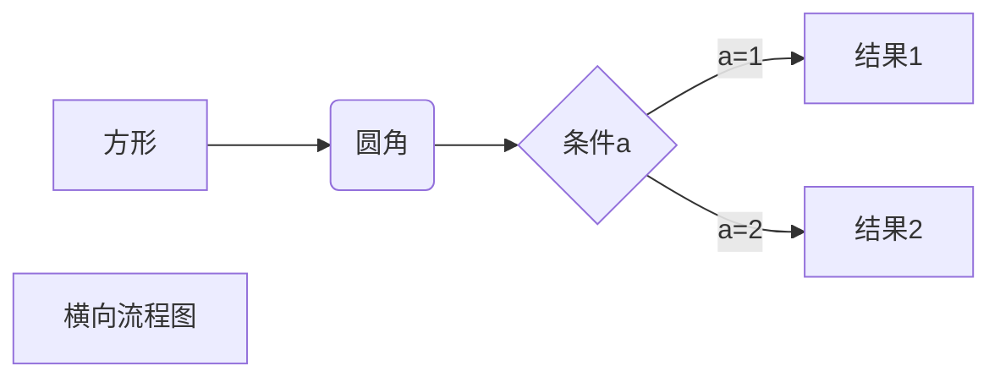

#### **2. 竖向流程图源码格式**
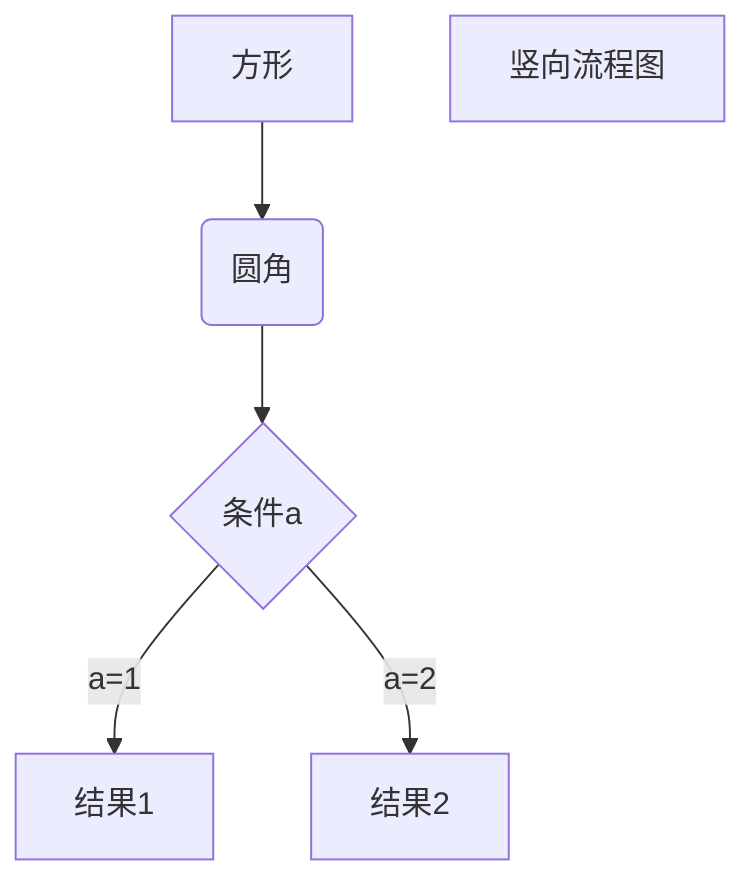

#### **3. 标准流程图源码格式**
```flow
st=>start: 开始框
op=>operation: 处理框
cond=>condition: 判断框(是或否?)
sub1=>subroutine: 子流程
io=>inputoutput: 输入输出框
e=>end: 结束框
st->op->cond
cond(yes)->io->e
cond(no)->sub1(right)->op
```

#### **4. 标准流程图源码格式（横向）**
```flow
st=>start: 开始框
op=>operation: 处理框
cond=>condition: 判断框(是或否?)
sub1=>subroutine: 子流程
io=>inputoutput: 输入输出框
e=>end: 结束框
st(right)->op(right)->cond
cond(yes)->io(bottom)->e
cond(no)->sub1(right)->op
```

#### **5. UML时序图源码样例**

```sequence
对象A->对象B: 对象B你好吗?（请求）
Note right of 对象B: 对象B的描述
Note left of 对象A: 对象A的描述(提示)
对象B-->对象A: 我很好(响应)
对象A->对象B: 你真的好吗？
```

#### **6. UML时序图源码复杂样例**

```sequence
Title: 标题：复杂使用
对象A->对象B: 对象B你好吗?（请求）
Note right of 对象B: 对象B的描述
Note left of 对象A: 对象A的描述(提示)
对象B-->对象A: 我很好(响应)
对象B->小三: 你好吗
小三-->>对象A: 对象B找我了
对象A->对象B: 你真的好吗？
Note over 小三,对象B: 我们是朋友
participant C
Note right of C: 没人陪我玩
```

#### **7. UML标准时序图样例**

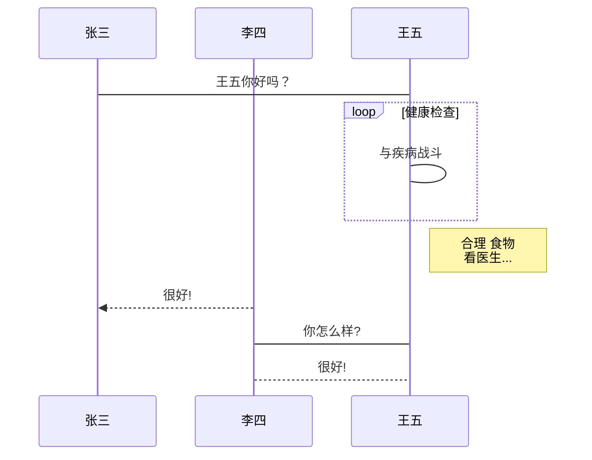

#### **8. 甘特图样例**

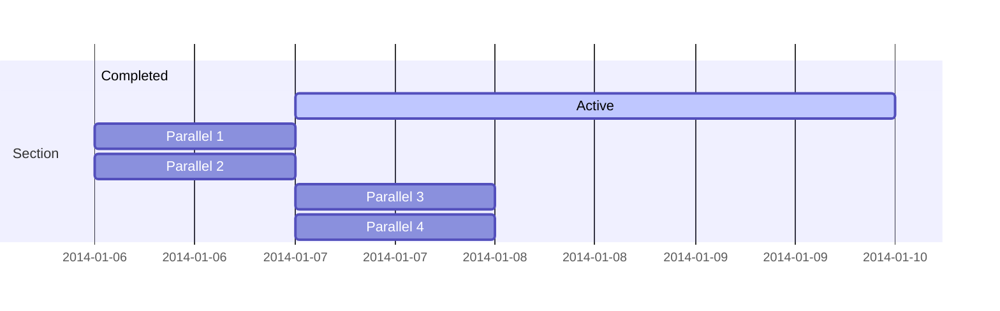

#### **9. 类图**
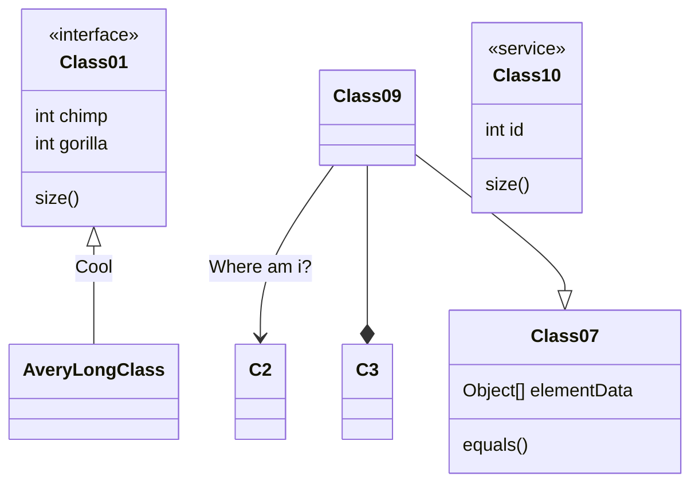

#### **10. 状态图**
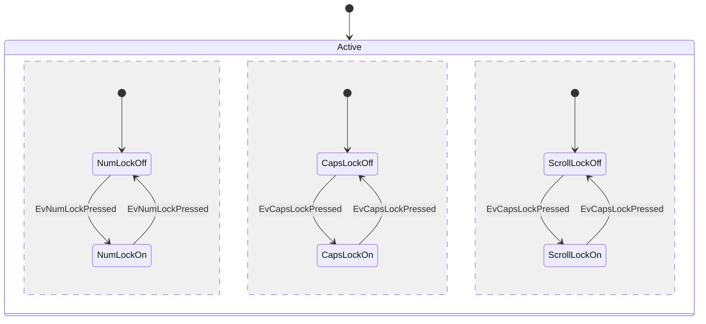

#### **11. 实体关系图**
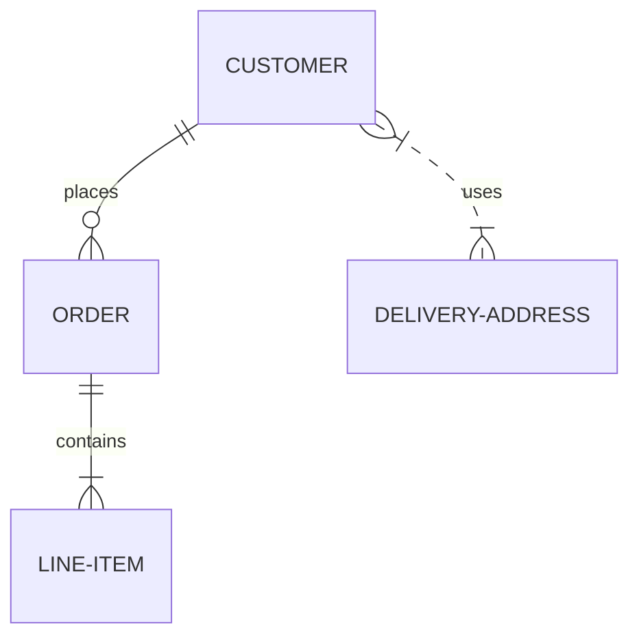

#### **12. 统计类图表**

**1. 饼图**
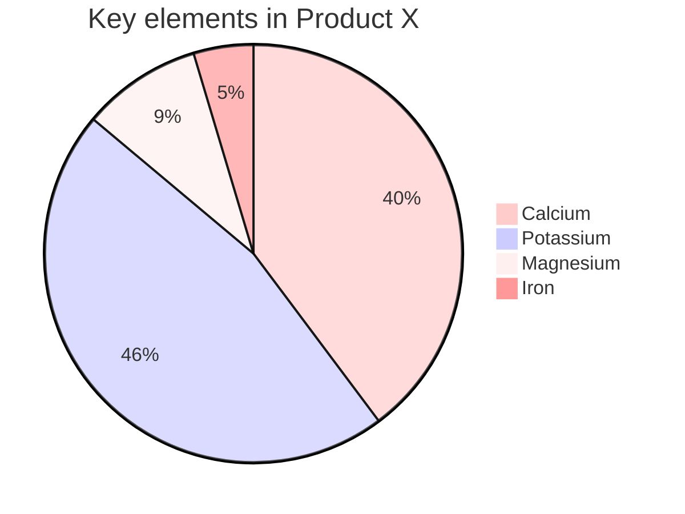

#### **13. 旅程图**
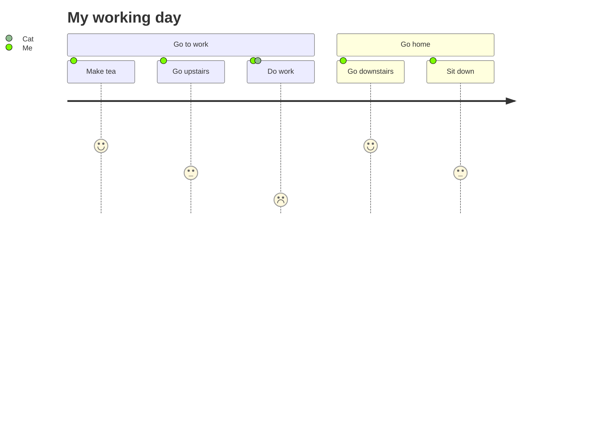

#### **14. subgraph**
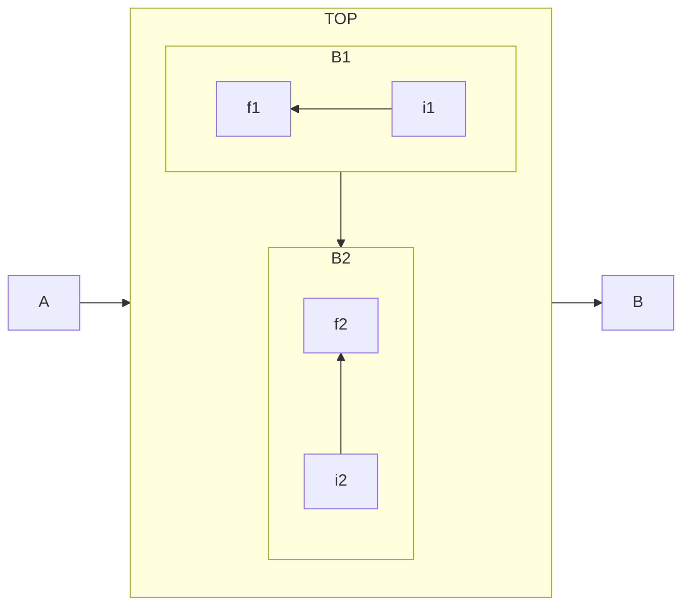

#### **15. Styling a node**
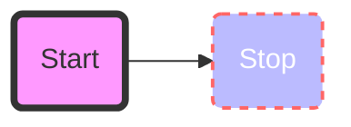

#### **16. Classes**
<style>
    .someclass > rect{
        fill:#FF0000;
        stroke:#FFFF00;
        stroke-width:4px;
    }
</style>
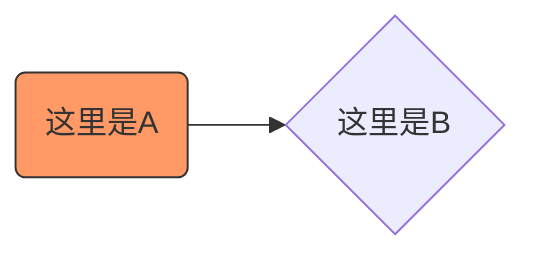
